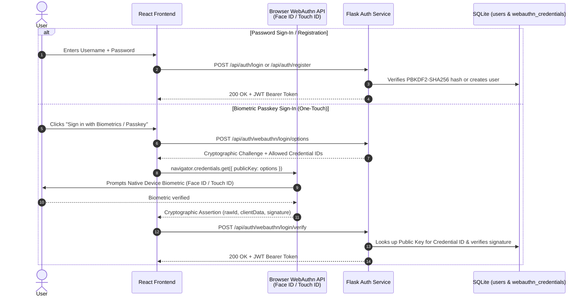
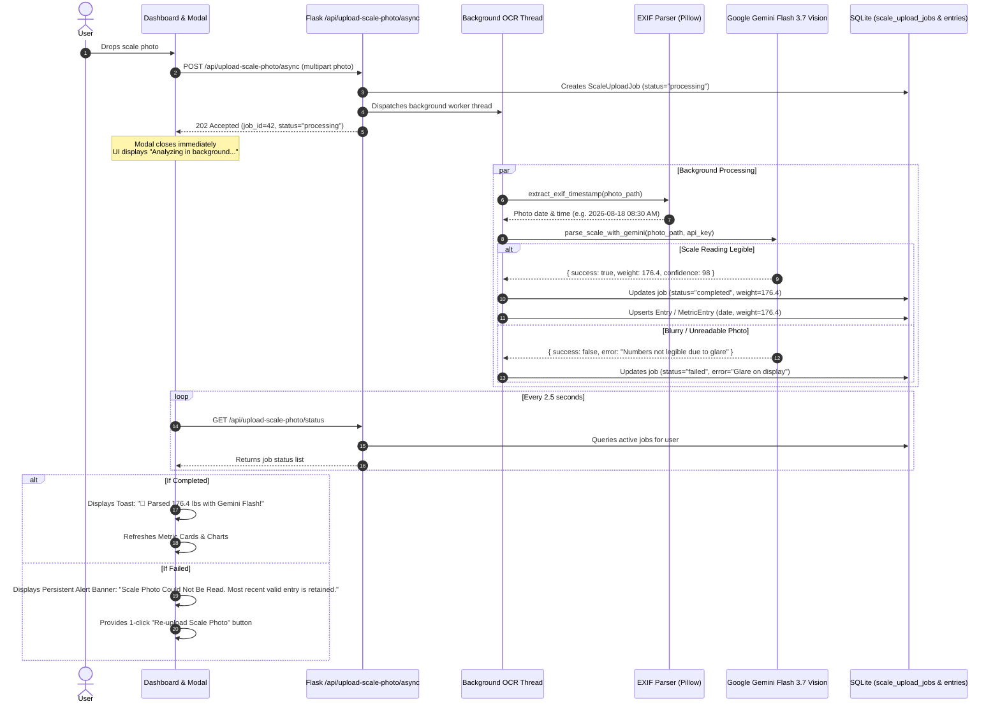
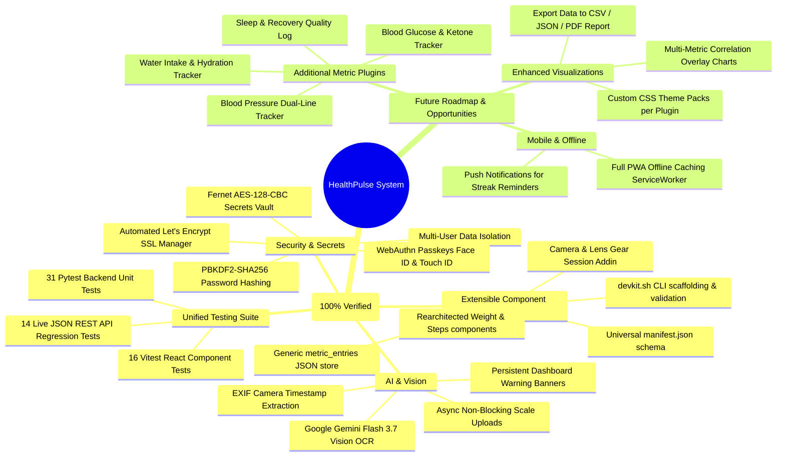

# 🏗️ HealthPulse System Architecture & Technical Specification

This document defines the complete end-to-end architecture of **HealthPulse**. It is authored in **Mermaid.js**, a plain-text diagramming language that renders natively on GitHub, in VS Code, Obsidian, and in the free interactive [Mermaid Live Editor](https://mermaid.live).

---

## 💡 How to Edit and Collaborate on These Diagrams

1. **In Any Markdown Viewer / GitHub**: Mermaid diagrams render automatically.
2. **Live Visual Editor**: Copy any ````mermaid ... ```` block into **[mermaid.live](https://mermaid.live)** to visually tweak nodes, test changes, and export to SVG/PNG.
3. **AI Collaboration**: You can tell the AI assistant: *"In ARCHITECTURE.md, update the Plugin Engine node to add X"* or edit the text directly and ask the assistant to review.

---

## 1. High-Level System Component Architecture

```mermaid
graph TB
  subgraph Client["Client Browser / Mobile PWA"]
    direction TB
    UI["React 18 Dashboard<br/>(Vite + Lucide Icons)"]
    BioAuth["WebAuthn Client<br/>(Face ID / Touch ID / Windows Hello)"]
    DynCard["DynamicMetricGrid<br/>(Cards for Weight, Steps, Gear)"]
    DynModal["DynamicLogModal<br/>(Auto-Generated Form Inputs)"]
    DynTable["DynamicHistoryTable<br/>(Multi-Metric Filter Timeline)"]
    PhotoUpload["PhotoUploadModal<br/>(Async Drag-and-Drop / Camera)"]
  end

  subgraph DevKit["Component DevKit & Plugins Layer"]
    direction TB
    WeightPlugin["plugins/weight/<br/>manifest.json"]
    StepsPlugin["plugins/steps/<br/>manifest.json"]
    CameraPlugin["plugins/camera_log/<br/>manifest.json"]
    FuturePlugin["plugins/&lt;new_metric&gt;/<br/>manifest.json"]
    DevKitCLI["devkit.sh CLI<br/>(create | validate | install | list)"]
  end

  subgraph Backend["Python Flask Backend Server (Port 5000 / 5099)"]
    direction TB
    AppRoutes["app.py<br/>(REST API & Plugin Dispatcher)"]
    PluginEngine["plugin_engine.py<br/>(Manifest Validator & Dynamic Stats)"]
    AuthService["auth_service.py<br/>(PBKDF2-SHA256 & JWT Sessions)"]
    WebAuthnSvc["WebAuthn Service<br/>(FIDO2 / Passkey Challenges)"]
    OCRService["ocr_service.py<br/>(Async Worker Pool)"]
    GeminiSvc["gemini_service.py<br/>(Google Gemini Flash Vision)"]
    ExifSvc["EXIF Parser<br/>(DateTimeOriginal Extraction)"]
    SecretsVault["secrets_vault.py<br/>(Fernet AES-128-CBC + HMAC)"]
    Config["config.py<br/>(Pydantic-Settings v2)"]
    SSLManager["ssl_manager.py<br/>(Let's Encrypt / Self-Signed SSL)"]
  end

  subgraph Database["SQLite Database (SQLAlchemy 2.0 ORM)"]
    direction TB
    T_Users["users<br/>(id, username, password_hash)"]
    T_MetricDefs["metric_definitions<br/>(id, name, manifest_json, is_active)"]
    T_MetricEntries["metric_entries<br/>(user_id, metric_id, date, payload_json)"]
    T_Entries["entries (Legacy Bridge)<br/>(user_id, date, weight, steps)"]
    T_Goals["goals<br/>(daily_steps, target_weight, gemini_api_key [ENC])"]
    T_Passkeys["webauthn_credentials<br/>(credential_id, public_key, sign_count)"]
    T_Jobs["scale_upload_jobs<br/>(status, weight, error, dismissed)"]
  end

  %% Connections
  UI --> BioAuth
  UI --> DynCard
  UI --> DynModal
  UI --> DynTable
  UI --> PhotoUpload

  DevKitCLI --> DevKit
  DevKit --> PluginEngine

  UI -- "HTTP / HTTPS REST API<br/>Bearer JWT" --> AppRoutes

  AppRoutes --> PluginEngine
  AppRoutes --> AuthService
  AppRoutes --> WebAuthnSvc
  AppRoutes --> OCRService
  AppRoutes --> SecretsVault
  AppRoutes --> Config
  AppRoutes --> SSLManager

  OCRService --> GeminiSvc
  OCRService --> ExifSvc

  PluginEngine --> T_MetricDefs
  PluginEngine --> T_MetricEntries
  AppRoutes --> T_Users
  AppRoutes --> T_Goals
  AppRoutes --> T_Passkeys
  AppRoutes --> T_Jobs
  AppRoutes --> T_Entries
  AppRoutes --> T_MetricEntries
```



---

## 2. DevKit & Dynamic Metric Plugin Lifecycle

How a new tracking box (e.g. *Camera & Lens Session*, *Blood Pressure*, *Water*) moves from a `manifest.json` to dynamic database storage and automatic UI rendering:

```mermaid
sequenceDiagram
  autonumber
  actor Dev as Developer / User
  participant CLI as devkit.sh CLI
  participant Folder as plugins/&lt;id&gt;/manifest.json
  participant Engine as backend/plugin_engine.py
  participant DB as SQLite (metric_definitions / metric_entries)
  participant API as Flask /api/plugins & /api/metrics
  participant UI as React Dynamic Components

  Dev->>CLI: ./devkit.sh create --id "camera_log" --name "Camera Log"
  CLI->>Folder: Generates manifest.json with fields & options
  Dev->>Folder: Customizes fields (camera_body, lens, ISO, aperture)
  Dev->>CLI: ./devkit.sh validate plugins/camera_log/
  CLI-->>Dev: Manifest Validated (100% compliant)

  Note over Engine,DB: Server Boot / Plugin Sync
  Engine->>Folder: Scans and loads manifest.json
  Engine->>DB: Upserts MetricDefinition (id, name, manifest_json)

  Note over UI,API: Frontend Discovery & Auto-Rendering
  UI->>API: GET /api/plugins
  API-->>UI: Returns registered component manifests
  UI->>UI: DynamicMetricGrid renders Camera Session Card
  UI->>UI: DynamicLogModal creates form inputs from manifest fields

  Note over Dev,UI: User Logging Flow
  Dev->>UI: Submits Camera shoot log (Sony A7 IV, 24-70mm, 1/500s)
  UI->>API: POST /api/metrics/camera_log/entries (payload JSON)
  API->>Engine: validate_payload("camera_log", payload)
  Engine-->>API: Validated Clean Payload
  API->>DB: Inserts MetricEntry (user_id, "camera_log", date, payload_json)
  API-->>UI: 201 Created

  UI->>API: GET /api/metrics/camera_log/stats
  API->>Engine: compute_stats("camera_log", user_entries)
  Engine-->>API: { total_sessions: 14, top_camera: "Sony A7 IV", top_lens: "24-70mm" }
  API-->>UI: Updates dashboard card in real-time
```

---

## 3. Multi-User Authentication & Biometric Passkey Flow



---

## 4. Async Scale Photo OCR & Warning Banner Pipeline



---

## 5. What is Currently Implemented vs Future Roadmap



---

## 📁 Repository Structure Map

```
health-tracker/
├── ARCHITECTURE.md                  <-- This master architecture document
├── README.md                        <-- User manual & quick-start guide
├── run.sh                           <-- 1-click development launcher
├── test.sh                          <-- 3-tier unified regression test runner
├── devkit.sh                        <-- Metric component DevKit CLI
├── setup_ssl.sh                     <-- Automated Let's Encrypt & SSL setup
├── plugins/                         <-- Component Plugin Packages
│   ├── weight/manifest.json         <-- Weight tracking component
│   ├── steps/manifest.json          <-- Daily step tracking component
│   └── camera_log/manifest.json     <-- Camera & Lens Session Addin
├── backend/
│   ├── app.py                       <-- Flask REST API & Plugin Routes
│   ├── plugin_engine.py             <-- Manifest validator & dynamic statistics
│   ├── models.py                    <-- SQLAlchemy 2.0 ORM Declarative Models
│   ├── database.py                  <-- ORM Sessions & Dynamic Metric CRUD
│   ├── schemas.py                   <-- Pydantic v2 DTO Request/Response Schemas
│   ├── secrets_vault.py             <-- Fernet AES-128-CBC Secrets Encryption
│   ├── config.py                    <-- Pydantic Settings Configuration
│   ├── auth_service.py              <-- Password Hashing, JWT & WebAuthn Logic
│   ├── ocr_service.py               <-- Async scale photo worker pool
│   ├── gemini_service.py            <-- Google Gemini Flash Vision API Client
│   ├── ssl_manager.py               <-- Let's Encrypt certbot integration
│   └── tests/                       <-- Pytest Backend & Live API Suites
│       ├── test_auth.py
│       ├── test_entries.py
│       ├── test_plugin_engine.py
│       ├── test_async_scale_ocr.py
│       ├── test_goals_secrets.py
│       ├── test_stats.py
│       └── api_regression_runner.py <-- Standalone JSON REST test runner
└── frontend/
    ├── src/
    │   ├── App.jsx                  <-- Main Dynamic Dashboard Controller
    │   ├── components/
    │   │   ├── DynamicMetricCard.jsx    <-- Renders any numeric/gear card
    │   │   ├── DynamicLogModal.jsx     <-- Auto-generated manifest forms
    │   │   ├── DynamicHistoryTable.jsx <-- Multi-metric filter timeline
    │   │   ├── MetricCards.jsx
    │   │   ├── Charts.jsx
    │   │   ├── PhotoUploadModal.jsx
    │   │   ├── GoalSettings.jsx
    │   │   └── AuthModal.jsx
    │   ├── utils/
    │   │   ├── pluginRegistry.jsx   <-- Dynamic icon mappings & styling
    │   │   └── webauthn.js          <-- Passkey & Biometric client utilities
    │   └── __tests__/               <-- Vitest React Component Tests
    │       ├── AuthModal.test.jsx
    │       ├── MetricCards.test.jsx
    │       ├── DynamicComponents.test.jsx
    │       ├── PhotoUploadModal.test.jsx
    │       └── webauthn.test.js
    └── vite.config.js
```
